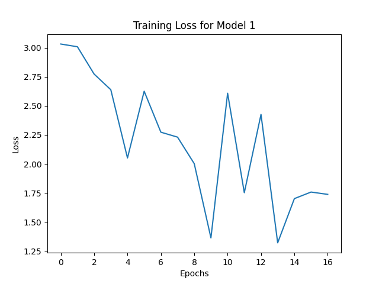
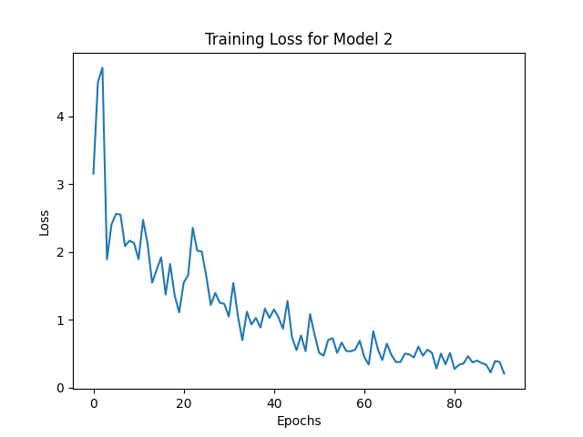
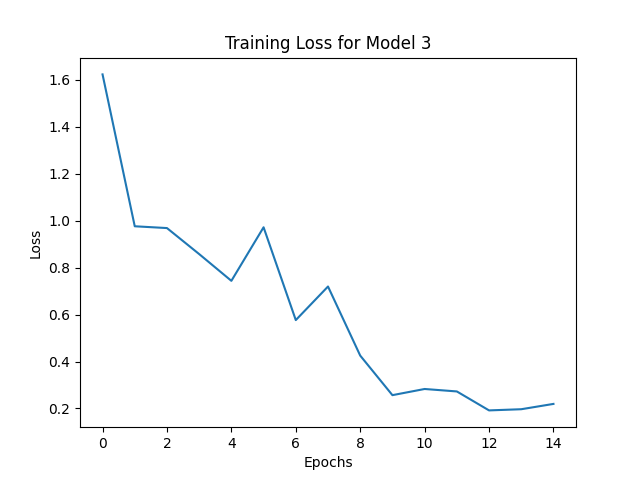
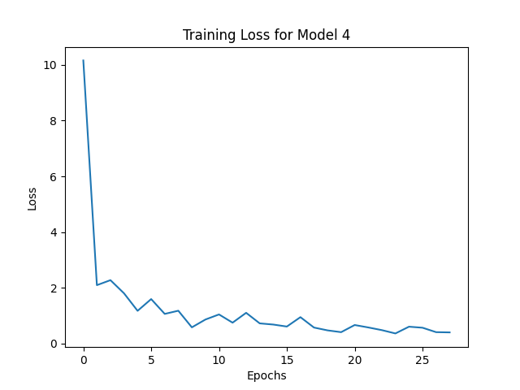
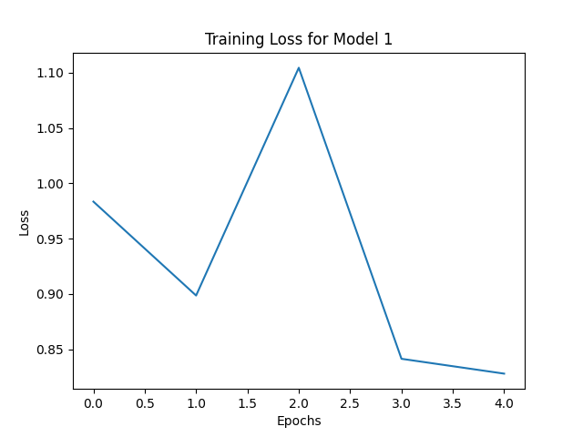
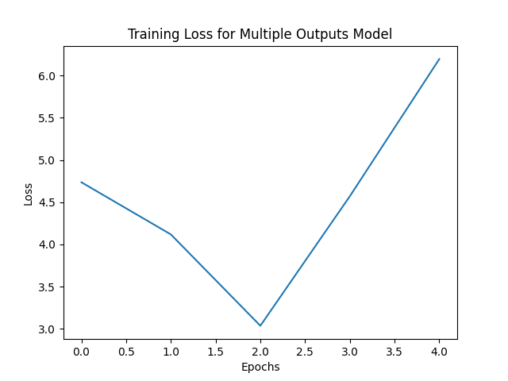
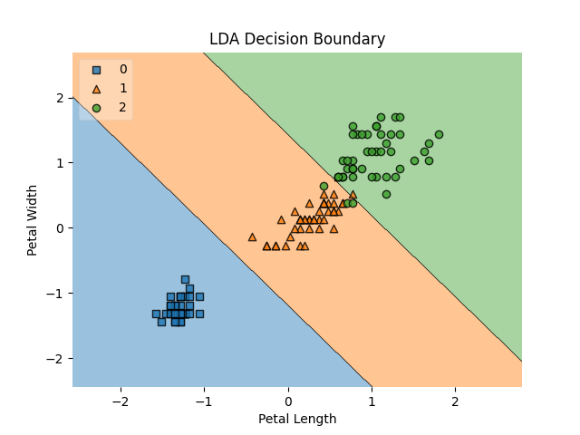
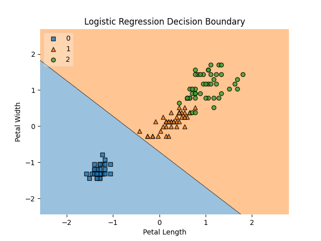
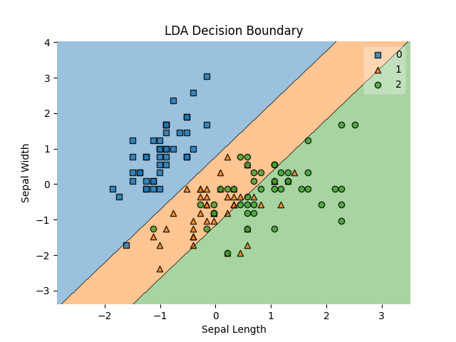
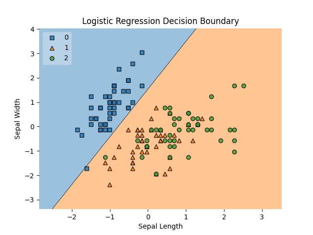

# **Assignment #1** 

## Linear Regression

### Regression with a single output

-   Ran data_prep.py before each training script.

-   For scripts where regularization is not mentioned, the loss and weight updates using regularization in LinearRegression.py were commented on.

#### Using sepal length and sepal width to predict petal length

-   Training Script: train_regression1.py

-   Evaluating Script: eval_regression1.py

Coefficients: \[\[ 1.41717164\] \[-1.48356905\]\]
Bias: \[\[0.02737106\]\]
Mean Squared Error for Model 1: 0.5086202394229078

#### Using petal length and petal width to predict sepal length

-   Training Script: train_regression2.py

-   Evaluating Script: eval_regression2.py

Coefficients: \[\[ 1.05298698\] \[-1.03296972\]\]
Bias: \[\[2.93609539\]\]
Mean Squared Error for Model 2: 0.5354093888899025

#### Using only sepal length and petal length to predict sepal width

-   Training Script: train_regression3.py

-   Evaluating Script: eval_regression3.py

Coefficients: \[\[ 0.54641586\] \[-0.13727658\]\]
Bias: \[\[0.17102886\]\]
Mean Squared Error for Model 3: 0.2688418286978594

#### Using sepal width and petal width to predict sepal length

-   Training Script: train_regression4.py

-   Evaluating Script: eval_regression4.py

Coefficients: \[\[1.37995327\] \[0.74148303\]\]
Bias: \[\[0.66255513\]\]
Mean Squared Error for Model 4: 0.5801201832130133

#### Using only sepal length and sepal width to predict petal length with Regularization

-   Training Script: train_regression1.py

-   Evaluating Script: eval_regression1.py

Coefficients: \[\[0.69335781\] \[0.00990055\]\]
Bias: \[\[-0.15110017\]\]
Mean Squared Error for Model 1 (regularization): 1.9498883913749374

#### The Input Feature Most Predictive Of Its Corresponding Output Feature

-   Model 1 (Predicting petal length from sepal length and sepal width):
    -   Coefficients: Sepal Length: 1.41717164, Sepal Width: -1.48356905
    -   Sepal width is slightly more predictive of petal length.
-   Model 2 (Predicting sepal length from petal length and petal width):
    -   Coefficients: Petal Length: 1.05298698, Petal Width: -1.03296972
    -   Petal length is marginally more predictive of sepal length than petal width.
-   Model 3 (Predicting sepal width from sepal length and petal length):
    -   Coefficients: Sepal Length: 0.54641586, Petal Length: -0.13727658
    -   Sepal length is more predictive of sepal width.
-   Model 4 (Predicting sepal length from sepal width and petal width):

    -   Coefficients: Sepal Width: 1.37995327, Petal Width: 0.74148303
    -   Sepal width is more predictive of sepal length.

-   Model 5 (Predicting petal length from sepal length and sepal width
    with regularization):

    -   Coefficients: Sepal Length: 0.69335781, Sepal Width: 0.00990055
    -   Sepal length is significantly more predictive of petal length when regularization is applied.

### Regression with Multiple Outputs

-   Ran data_prep_multiple.py before the training script.

#### Using sepal length and width width to predict petal length and width

-   Training Script: train_regression_multiple.py

-   Evaluating Script: eval_regression_multiple.py

Mean Squared Error for Multiple Outputs Model: 1.9576739929445148

## Classification

### Using all features

-   Ran data_prep_classifiers1.py before the training script.
-   Training Scripts: train_logistic1.py and train_lda1.py
-   Evaluating Script: eval_classifiers1.py

LDA Accuracy: 100.00%
Logistic Regression Accuracy: 66.67%

### Using petal length and width

-   Ran data_prep_classifiers2.py before the training script.
-   Training Scripts: train_logistic2.py and train_lda2.py
-   Evaluating Script: eval_classifiers2.py

LDA Accuracy: 93.33%
Logistic Regression Accuracy: 66.67%

### Using sepal length and width

-   Ran data_prep_classifiers3.py before the training script.
-   Training Scripts: train_logistic3.py and train_lda3.py
-   Evaluating Script: eval_classifiers3.py

LDA Accuracy: 80.00%
Logistic Regression Accuracy: 66.67%

## Resources Used

1.  OpenAI. (2023). ChatGPT by OpenAI \[Online Tool\]. Retrieved from
    https://www.openai.com/

2.  StatQuest with Josh Starmer. (n.d.). StatQuest Playlists \[Video
    Playlist\]. YouTube. Retrieved from
    https://www.youtube.com/@statquest/playlists
