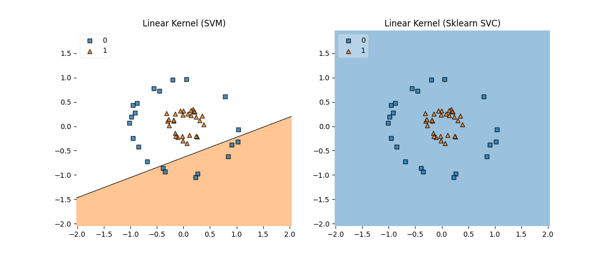
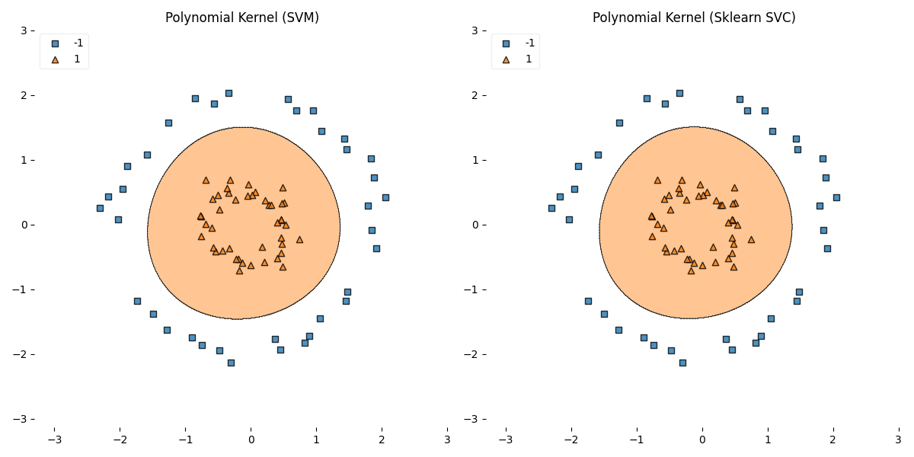

# Assignment #2

## Task 1: The Negative \$\\eta\$ Case

### The Negative \$\\eta\$ Case implementation

-   Modifications made in **smo.py** file in **smo_step()** function.
-   Test Script: **test_task1_svm.py**
-   Output on terminal:

SVM Accuracy: 45.00%
SVC Accuracy: 100.00%

### A Kernel Function That Would Result In A Kernel Matrix That Is Not Positive Semidefinite

If we consider the \"sigmoid kernel\" which is defined as
$K(x,y) = tanh(ax \cdot y + b)$

For some a and b, this kernel doesn\'t satisfy Mercer\'s condition,
which makes it not positive semidefinite.

The proof of the example has also been implemented in the **test_task1_kernelFunction.py** script. The sigmoid kernel with the
parameters a = 1 and b = −1 and the chosen input vectors provide an
example of a kernel matrix that is not positive semidefinite.

## Task 2: Non-linear SVM

### For Linear Kernel

Test Script: **test_task2_linear.py**

Output on terminal:

	Linear Kernel (SVM) Accuracy: 8.0 %
	Linear Kernel (Sklearn SVC) Accuracy: 42.0 %

Plot:

### For Polynomial Kernel

Test Script: **test_task2_polynomial.py**

Output on terminal:

	Polynomial Kernel (SVM) Accuracy: 100.00 %
	Polynomial Kernel (Sklearn SVC) Accuracy: 100.00 %

Plot:

**NOTE:** the test script for the polynomial kernel takes a long time to
finish executing. The last run took approximately 5 mins.

## Task 3: Multi-class SVM

The **MultiSVM** class is in **smo.py** file.

### For Linear Kernel

-   Test Script: **test_task3_linear.py**

-   Output on terminal:

		Linear Kernel (MultiSVM) Accuracy: 86.67 %
		Linear Kernel (Sklearn\'s SVC) Accuracy: 100.0 %

### For Polynomial Kernel

-   Test Script: **test_task3_polynomial.py**

-   Output on terminal:

		Polynomial Kernel (MultiSVM) Accuracy: 100.0 %
		Polynomial Kernel (Sklearn\'s SVC) Accuracy: 93.33 %

**NOTE:** the test script for the polynomial kernel takes a long time to
finish executing. The last run took approximately 7 mins.

## Resources Used

1.  OpenAI. (2023). ChatGPT by OpenAI \[Online Tool\]. Retrieved from
    https://www.openai.com/

2.  StatQuest with Josh Starmer. (n.d.). StatQuest Playlists \[Video
    Playlist\]. YouTube. Retrieved from
    https://www.youtube.com/@statquest/playlists

3.  Dillhoff, A. J. (n.d.). Support Vector Machines. Retrieved from
    https://ajdillhoff.github.io/notes/support_vector_machine/

4.  Dillhoff, A. J. (n.d.). Sequential Minimal Optimization. Retrieved
    from
    https://ajdillhoff.github.io/notes/sequential_minimal_optimization/

5.  scikit-learn developers (n.d.). Kernel Principal Component Analysis.
    Retrieved from
    https://scikit-learn.org/stable/auto_examples/decomposition/plot_kernel_pca.html#sphx-glr-auto-examples-decomposition-plot-kernel-pca-py
