# Assignment #3

## Task 1: Neural Network Library

-   Implemented all the classes in **neural_networks.py** file.
-   Scripts for testing all the implemented classes are in
    **test_neural_networks.py** file.

## Task 2: XOR Problem

-   Implemented the XOR problem in the **xor_problem.py** file.
-   To verify the output, run **xor_problem.py** script.

After solving the problem using sigmoid activations and then again using
hyperbolic tangent activations, the script determines which function
performed better and saves the weight for that function:

```sh
PS C:\Users\meghn\Downloads\~Courses\ML\Assignments\Assignment 3\CSE6363_Assignment3> & C:/Users/meghn/AppData/Local/Programs/Python/Python311/python.exe "c:/Users/meghn/Downloads/~Courses/ML/Assignments/Assignment 3/CSE6363_Assignment3/xor_problem.py"  
Training with Sigmoid Activation...  
Epoch 0, Loss: 0.7787736655418904  
Epoch 1000, Loss: 0.49906765297472844  
Epoch 2000, Loss: 0.06849937547359986  
Epoch 3000, Loss: 0.027973633116506514  
Epoch 4000, Loss: 0.01729601984204172  
Epoch 5000, Loss: 0.012463010462073022  
Epoch 6000, Loss: 0.009722917242946195  
Epoch 7000, Loss: 0.007962750872491646  
Epoch 8000, Loss: 0.006738283181012294  
Epoch 9000, Loss: 0.005838018307081359  
Predictions with Sigmoid Activation: [[0.00580844]  
[0.99570238]  
[0.99569575]  
[0.00612987]]  
  
Training with Tanh Activation...  
Epoch 0, Loss: 0.864872200565151  
Epoch 1000, Loss: 0.3505599664440613  
Epoch 2000, Loss: 0.3484315023139926  
Epoch 3000, Loss: 0.34777311430369984  
Epoch 4000, Loss: 0.34745565049209515  
Epoch 5000, Loss: 0.347269519366384  
Epoch 6000, Loss: 0.34714746813787717  
Epoch 7000, Loss: 0.3470613886981755  
Epoch 8000, Loss: 0.34699748381550694  
Epoch 9000, Loss: 0.3469481980577216  
Predictions with Tanh Activation: [[3.33008421e-04]  
[4.99851495e-01]  
[9.99621716e-01]  
[5.00166657e-01]]  
Thresholded Predictions with Sigmoid Activation:  
[[0]  
[1]  
[1]  
[0]]  
  
Thresholded Predictions with Tanh Activation:  
[[0]  
[0]  
[1]  
[1]]  
Sigmoid model performed better. Saving weights...**
```
 
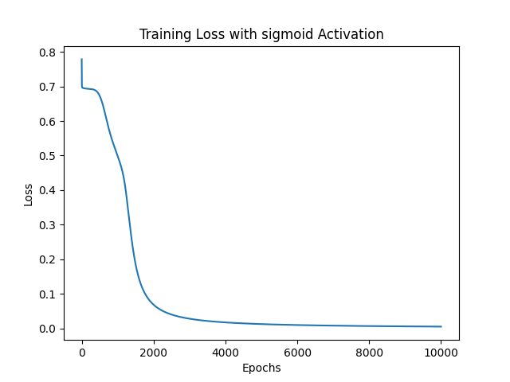
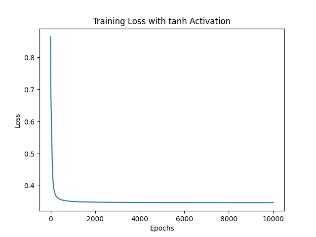

The neural network model with the Sigmoid activation function was easier
to train for the XOR problem and yielded accurate predictions. On the
other hand, the model with the Hyperbolic Tangent (Tanh) activation
function did not converge as effectively and failed to produce the
correct outputs for the XOR problem within the same number of training
epochs.

## Task 3: Predicting Trip Duration

-   Link to Dataset: kaggle.com/competitions/nyc-taxi-trip-duration/data
-	Before running any scripts for Task 3, the test.csv and train.csv should be in the 'nyc-taxi-trip-duration' directory.
-	To verify the output, run the **trip_duration_prediction.py**
    script.

### Dataset Preprocessing

-   Implemented the data preprocessing script in the
    **data_preprocessing.py** file.
    -   The training data has been split into 80% for training the model and 20% for validation. From the part for training the model is further split such that 5% is kept for testing the model.

-   Visualization:

    -   Created histograms to see the distribution of potential features. All the plots created are in the **data_preprocessing_visualizations** directory.

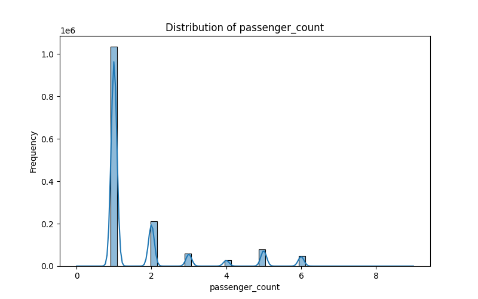
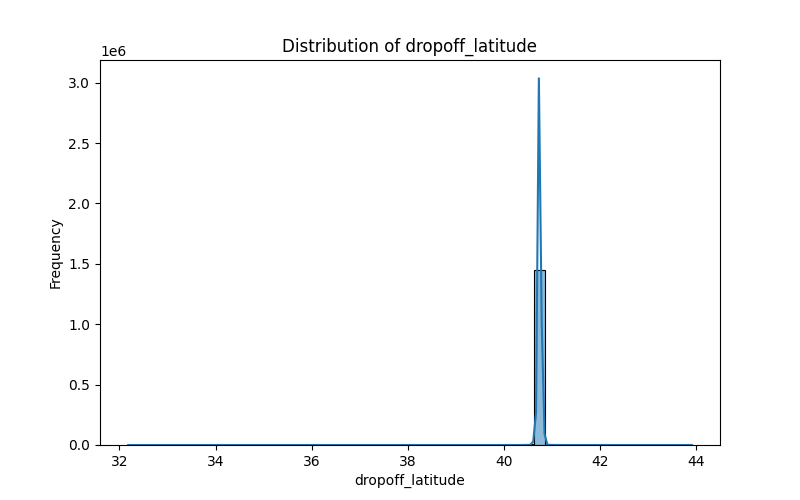
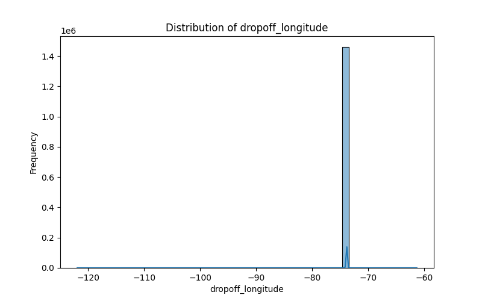
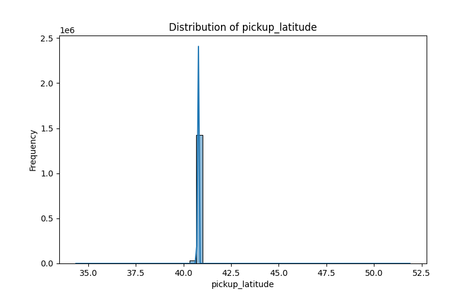

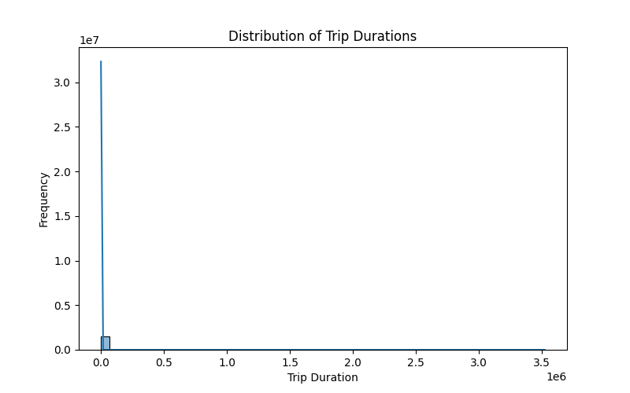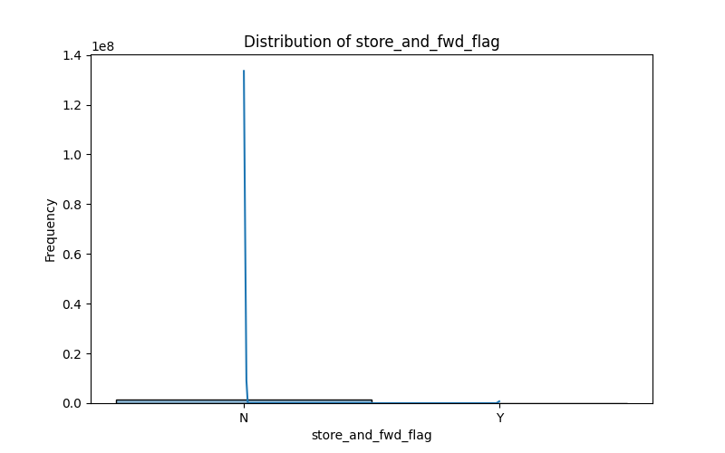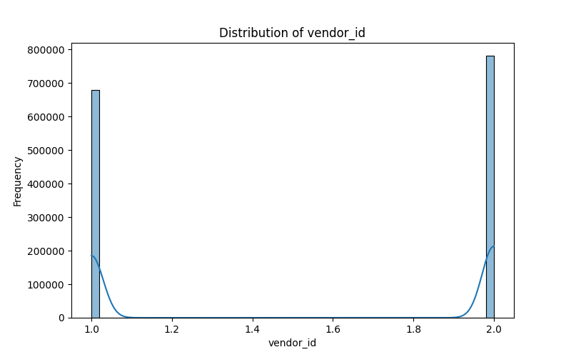

-   Below is the correlation matrix that highlights the relationships between the potential features and the 'trip_duration' variable.

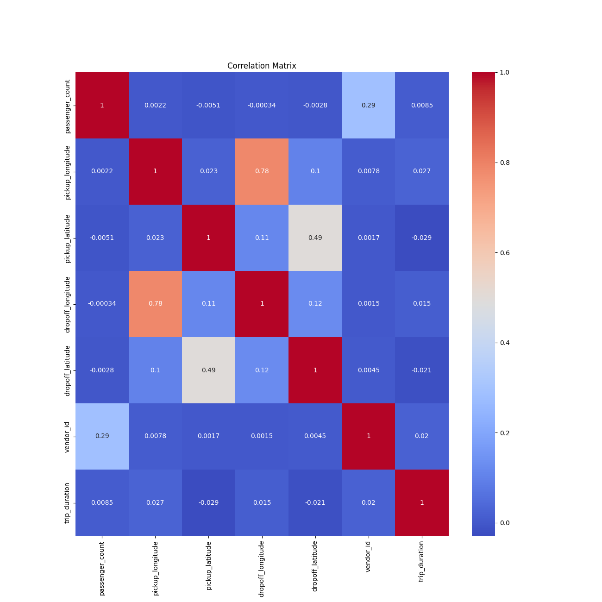

-   Based on these visualizations, selected the following for predicting the trip duration: \'passenger_count\', \'pickup_longitude\', \'pickup_latitude\', \'dropoff_longitude\', and \'dropoff_latitude\'.

-   Used StandardScaler to normalize the features to ensure consistent scaling, aiding in effective model training.

### Model Selection

-   Implemented the scripts for this section in the
    **trip_duration_prediction.py** file.

-   Model Configuration:

    -   Configuration 1:
        -   2 Hidden Layers: 10 and 5 neurons
        -   Learning Rate: 0.001
        -   Activation Function: Sigmoid
        -   Plots after training:

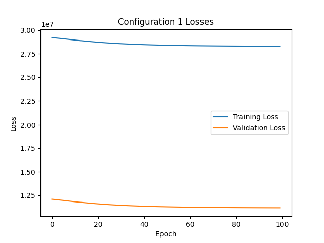

-   Configuration 2:
    -   3 Hidden Layers: 15, 10, and 5 neurons
    -   Learning Rate: 0.005
    -   Activation Function: Sigmoid
    -   Plots after training:

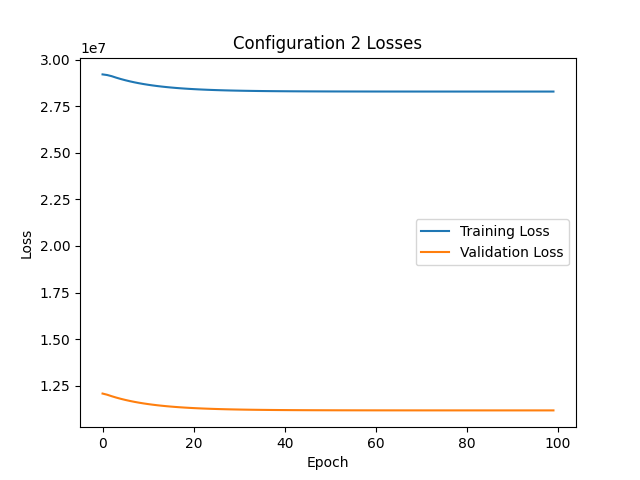

-   Configuration 3:
    -   2 Hidden Layers: 20 and 10 neurons
    -   Learning Rate: 0.01
    -   Activation Function: Sigmoid
    -   Plots after training:

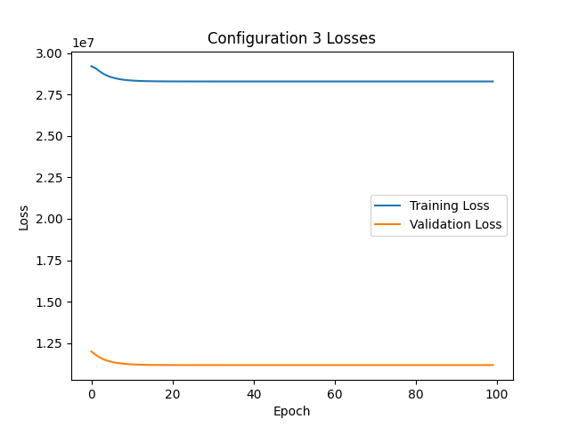

-   Output of the script on terminal:
	```sh
	PS C:\Users\meghn\Downloads\~Courses\ML\Assignments\Assignment 3\CSE6363_Assignment3> & C:/Users/meghn/AppData/Local/Programs/Python/Python311/python.exe "c:/Users/meghn/Downloads/~Courses/ML/Assignments/Assignment 3/CSE6363_Assignment3/trip_duration_prediction.py"  
	Training Configuration 1...  
	Epoch [10/100], Loss: 28978827.8798, Val Loss: 11851694.7525  
	Epoch [20/100], Loss: 28742301.5384, Val Loss: 11619861.5874  
	Epoch [30/100], Loss: 28578597.8139, Val Loss: 11460842.5490  
	Epoch [40/100], Loss: 28473672.7695, Val Loss: 11358535.3182  
	Epoch [50/100], Loss: 28406427.7165, Val Loss: 11292657.0314  
	Epoch [60/100], Loss: 28363331.5168, Val Loss: 11250187.7848  
	Epoch [70/100], Loss: 28335711.9478, Val Loss: 11222770.6880  
	Epoch [80/100], Loss: 28318011.0816, Val Loss: 11205040.0067  
	Epoch [90/100], Loss: 28306666.9306, Val Loss: 11193548.9991  
	Epoch [100/100], Loss: 28299396.6799, Val Loss: 11186082.3613  
	  
	  
	Training Configuration 2...  
	Epoch [10/100], Loss: 28689582.0031, Val Loss: 11546610.4134  
	Epoch [20/100], Loss: 28430949.8458, Val Loss: 11308723.0490  
	Epoch [30/100], Loss: 28338233.4914, Val Loss: 11222369.1133  
	Epoch [40/100], Loss: 28304995.8909, Val Loss: 11190769.1116  
	Epoch [50/100], Loss: 28293080.6535, Val Loss: 11179055.7953  
	Epoch [60/100], Loss: 28288809.2008, Val Loss: 11174626.1329  
	Epoch [70/100], Loss: 28287277.9427, Val Loss: 11172900.0923  
	Epoch [80/100], Loss: 28286729.0074, Val Loss: 11172198.6646  
	Epoch [90/100], Loss: 28286532.2215, Val Loss: 11171897.7174  
	Epoch [100/100], Loss: 28286461.6764, Val Loss: 11171760.1974  
	  
	  
	Training Configuration 3...  
	Epoch [10/100], Loss: 28361136.5525, Val Loss: 11231216.0633  
	Epoch [20/100], Loss: 28290081.3290, Val Loss: 11175281.7731  
	Epoch [30/100], Loss: 28286601.4549, Val Loss: 11171959.6500  
	Epoch [40/100], Loss: 28286431.0311, Val Loss: 11171667.9808  
	Epoch [50/100], Loss: 28286422.6847, Val Loss: 11171625.1552  
	Epoch [60/100], Loss: 28286422.2759, Val Loss: 11171616.7416  
	Epoch [70/100], Loss: 28286422.2559, Val Loss: 11171614.9318  
	Epoch [80/100], Loss: 28286422.2549, Val Loss: 11171614.5338  
	Epoch [90/100], Loss: 28286422.2549, Val Loss: 11171614.4458  
	Epoch [100/100], Loss: 28286422.2549, Val Loss: 11171614.4264  
	  
	Configuration 1 Training RMSE: 5319.7177  
	Configuration 1 Validation RMSE: 3344.5601  
	  
	Configuration 2 Training RMSE: 5318.5018  
	Configuration 2 Validation RMSE: 3342.4183  
	  
	Configuration 3 Training RMSE: 5318.4981  
	Configuration 3 Validation RMSE: 3342.3965**
	```

-   Analyzing accuracy using Root Mean Squared Error.

    -   RMSE is a measure of the differences between the predicted and observed values. The lower the RMSE, the better the model\'s performance.
    -   All configurations have a similar performance on the training and validation datasets, with very minor differences.
    -   Configuration 3 has the smallest RMSE on both the training and validation datasets, making it the best-performing model among the three.

## Resources Used

1.  OpenAI. (2023). ChatGPT by OpenAI \[Online Tool\]. Retrieved from
    https://www.openai.com/
2.  StatQuest with Josh Starmer. (n.d.). StatQuest Playlists \[Video
    Playlist\]. YouTube. Retrieved from
    https://www.youtube.com/@statquest/playlists
3.  Dillhoff, A. J. (n.d.). Neural Networks. Retrieved from
    https://ajdillhoff.github.io/notes/neural_networks/
