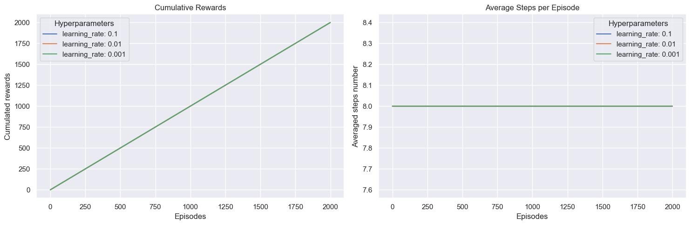
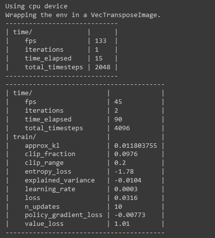

# Assignment #5

## Part 1: Q-Learning and Policy Iteration on the Frozen Lake Environment

-   The script for part 1 has been implemented in **part1_main.py** file.

### Output

-   Output on terminal after running the **part1_main.py** script.

-   Note: The script takes a long time (last run took 30 mins) to
    complete the run. While running the scripts there will be warnings
    for deprecated features; please ignore those warnings.

### Hyperparameter Analysis

-   For Hyperparameter analysis, we are varying one hyperparameter at a
    time to analysis its impact on the learning rate.

#### Impact of Learning Rate on Learning process

-   Gamma: 0.8
-   Epsilon: 0.01

Plots for Q-Learning algorithm:

Analysis:
-   A learning rate of 0.01 strikes a good balance between convergence
    speed and stability in this environment.
-   Over time, a learning rate of 0.01 leads to better performance in
    terms of the total reward accumulated.
-   Learning rate does not affect the length of the paths taken by the
    agent to reach the goal.

Plots for Policy Iteration:

Analysis:
-   Policy Iteration is not affected by the learning rate.

#### Impact of Gamma on Learning process

-   Learning Rate: 0.1
-   Epsilon: 0.01

Plots for Q-Learning algorithm:

Analysis:

-   A lower gamma is more suitable for this environment.
-   The agent does not benefit as much from emphasizing future rewards
    in this environment.
-   The number of steps slightly decreases as gamma increases.

**Plots for Policy Iteration:**

Analysis:
-   Policy Iteration computes the optimal policy based on the full model
    of the environment, the discount factor does not affect its
    performance.

#### Impact of Epsilon on Learning process

-   Learning Rate: 0.1
-   Gamma: 0.8

Plots for Q-Learning algorithm:

Analysis:
-   The output suggests that some degree of exploration is beneficial,
    but too much can prevent the agent from consistently exploiting the
    best-known paths.
-   The average number of steps taken per episode remains relatively
    consistent across different exploration rates. This implies that the
    exploration rate does not have a significant impact on the length of
    the paths taken by the agent to reach the goal.

Plots for Policy Iteration:

Analysis:
-   Policy Iteration consistently achieves an average reward of 1.0,
    confirming that the exploration rate does not impact its
    performance.

### Performance Comparison

+-----------------------------------+-----------------------------------+
| **Q-Learning**                    | **Policy Iteration**              |
+===================================+
| Q-Learning | Policy Iteration |
|--|--|
|Performance varies with different hyperparameters, suggesting that it requires careful tuning to achieve optimal results. The average rewards for Q-Learning are lower than the consistent perfect score achieved by Policy Iteration.|Consistently Optimal. It consistently finds the optimal policy for the given environment.|
|The cumulative rewards for Q-Learning are lower than for Policy Iteration, and they fluctuate based on the hyperparameter settings.  |The average cumulative rewards for Policy Iteration are also consistently at the maximum possible value, suggesting that the agent successfully reaches the goal in every episode.|
|The average number of steps for Q-Learning doesn't show dramatic variations and it does not consistently reach the minimum possible steps as Policy Iteration does.|The number of steps remains constant at 8.0, demonstrating that Policy Iteration consistently finds the most efficient policy.|

-   Therefore, We can say Policy Iteration performs better in this
    environment.

## Part 2: Proximal Policy Optimization on an Atari Game Environment

-   Atari game environment chosen: **Pong-v0**

### Q-Learning Implementation

-   Implemented all the functionality for Q-Learning in the
    **part2_qlearning.ipynb** file.

#### Output

-   Output is very long. Therefore, attaching the screenshots for the
    end of execution.
-   Ran the model for 2 episodes as it was taking too long.
-   Evaluated the model for 1 episode.

Analysis:

-   Average reward over the 1 episode evaluated is -21.0. This means the
    agent lost the game by a margin of 21 points.
-   The episode length is high, which indicates that the agent managed
    to keep the ball in play for a significant amount of time.

### PPO Implementation

-   Implemented all the functionality for PPO in the **part2_ppo.ipynb**
    file.

#### Output

-   Output is very long. Therefore, attaching the screenshots for the
    beginning and end of execution.

Analysis:

-   Training ran for 49 iterations.
-   Policy distribution changes moderately (approx_kl is around for all
    iterations 0.01).
-   Entropy loss is decreasing that means there is less randomness and
    that the model is learning.
-   The value of explained_variance shows that the model's predictions
    are not the same as the true value.
-   The highest reward is -18 and lowest is -36, and remains consistent
    at -21 which shows that the model is not improving.

### Performance Comparison

-   Both Q-Learning and PPO agent had similar episode length (around
    1000 steps), which can indicate that both agents learned to keep the
    episode (game) running.
-   Noting that for Q-learning we have limited data, based on learning
    performance we can conclude that PPO had a stable learning policy.

## Resources Used

1.  OpenAI. (2023). ChatGPT by OpenAI \[Online Tool\]. Retrieved from
    https://www.openai.com/
2.  Gymnasium Farama. (n.d.). Q-Learning on Frozen Lake. Gymnasium
    Documentation. Retrieved from
    https://gymnasium.farama.org/tutorials/training_agents/FrozenLake_tuto/
3.  OpenAI. (n.d.). Proximal Policy Optimization. OpenAI. Retrieved from
    https://openai.com/research/openai-baselines-ppo/
4.  Weights & Biases. (n.d.). Proximal Policy Optimization explained.
    \[Video\]. YouTube. Retrieved from
    https://www.youtube.com/watch?v=MEt6rrxH8W4&ab_channel=Weights%26Biases
5.  ICLR Blog Track. (2022, March 25). The 37 Implementation Details of
    Proximal Policy Optimization. Retrieved from
    https://iclr-blog-track.github.io/2022/03/25/ppo-implementation-details/
6.  Gymnasium Farama. (n.d.). Atari Environments. Gymnasium
    Documentation. Retrieved from
    https://gymnasium.farama.org/environments/atari/
7.  Kurganov, S. (Year). Atari Games with Proximal Policy Optimization.
    Medium. Available at:
    https://medium.com/@shogulomkurganov73/atari-games-with-proximal-policy-optimization-ed28c7fafa3f.
